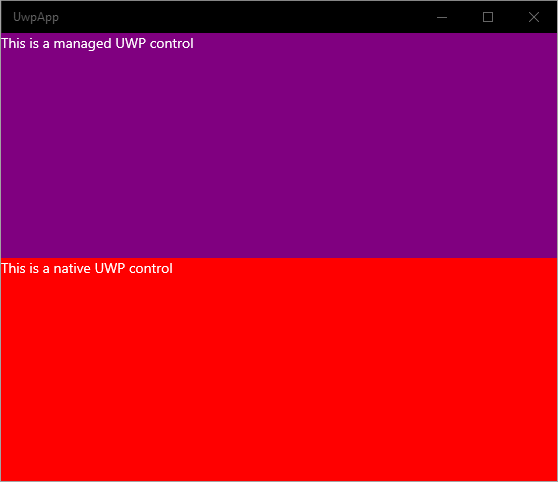

# UWP UI Permutations

Purpose is to experiment with methods to include UWP in WPF. This showcases issues including C++/WinRT controls with `WindowsXamlHost`.

Projects: 
* UwpLib
  * Single managed control `ManagedGrid` (purple background and text "This is a managed UWP control").
* UwpLibNative
  * Single native (C++/WinRT) control `NativeGrid` (red background and text "This is a native UWP control").
* UwpApp
  * References UwpLib and UwpLibNative
  * Both `ManagedGrid` and `NativeGrid` can be composed.
  
  
* WpfAppCore3.1
  * References UwpLib and UwpLibNative
  * Using Xaml Islands `ManagedGrid` can be composed but `NativeGrid` cannot.

  ```
  System.BadImageFormatException: 'Bad IL format.'
  ```

  